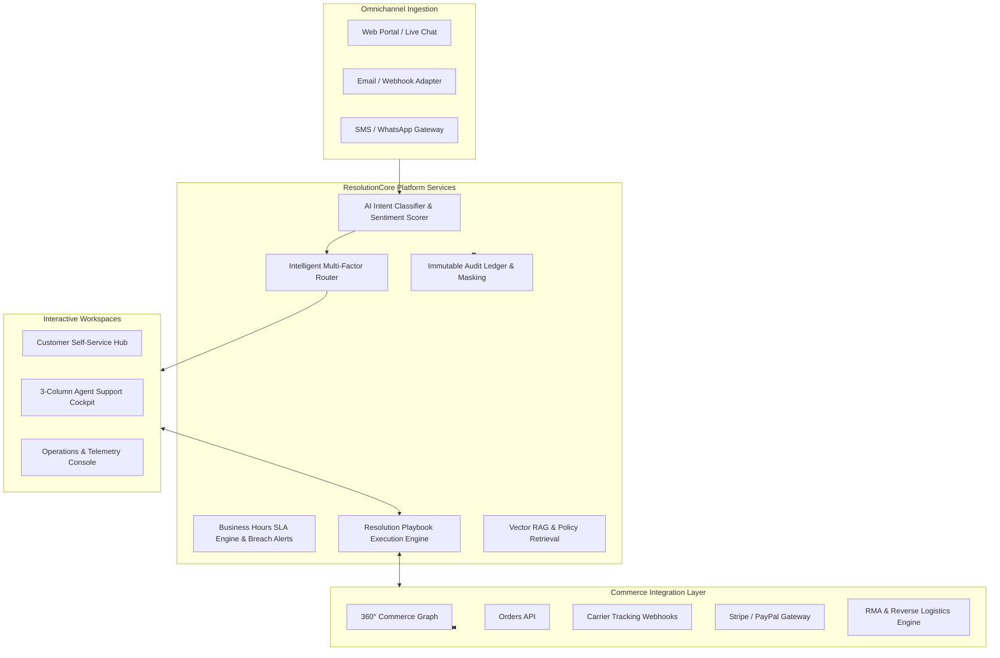

# E-Commerce Customer Support & Resolution Management Platform

Production-grade, enterprise customer support, unified commerce context, and AI resolution cockpit built for high-scale e-commerce operations.

[](https://github.com/SnehaPullagura/customer-support_e-commerce)
[](LICENSE)
[](https://www.python.org/)
[](https://fastapi.tiangolo.com/)
[](https://nextjs.org/)

---

## 1. System Overview & Core Capabilities

The platform manages the complete customer support and order issue resolution lifecycle for modern e-commerce businesses:



---

## 2. 25 Business Domains & Module Hierarchy

| # | Domain Module | Backend Location | Key Responsibility |
|---|---|---|---|
| 01 | **Identity & Access Management** | `backend/app/services/identity_service.py` | JWT authentication, RBAC permission matrices, audit context. |
| 02 | **Customer Management** | `backend/app/services/customer_service.py` | Customer profiles, VIP tiers, notification preferences, tags. |
| 03 | **Case Management** | `backend/app/services/case_service.py` | Case sequences (`CASE-YYYYMMDD-XXXX`), state machines, timeline ledger. |
| 04 | **Ticket Management** | `backend/app/services/ticket_service.py` | Sub-ticket task breakdown, attachments, assignments. |
| 05 | **Conversation & Messaging** | `backend/app/services/conversation_service.py` | Real-time WebSocket streaming, internal notes, read receipts. |
| 06 | **Agent Workforce Management** | `backend/app/services/agent_service.py` | Skill profiles, availability, capacity meters, team assignments. |
| 07 | **Intelligent Routing** | `backend/app/services/routing_service.py` | Multi-factor workload, language, skill-matching rule engine. |
| 08 | **Commerce Integration Layer** | `backend/app/adapters/commerce/` | Clean decoupled adapter for Orders, Shipments, Payments, RMAs. |
| 09 | **SLA Management** | `backend/app/services/sla_service.py` | Business-hours timers, pause/resume tracking, breach logs. |
| 10 | **Escalation Management** | `backend/app/services/escalation_service.py` | Multi-tiered escalation matrix, supervisor reassignment. |
| 11 | **Resolution Engine** | `backend/app/services/resolution_service.py` | Replacement, refund, courtesy credit actions with threshold approval. |
| 12 | **Resolution Playbooks** | `backend/app/services/playbook_service.py` | Guided step-by-step decision trees for damaged goods, late shipments. |
| 13 | **Knowledge Base** | `backend/app/services/knowledge_service.py` | Policy articles, category hierarchy, helpfulness tracking. |
| 14 | **Customer Self-Service** | `backend/app/services/self_service_service.py` | Guided deflection workflows, order tracking explorer. |
| 15 | **Return & Replacement** | `backend/app/services/returns_service.py` | RMA authorization, return labels, reverse logistics. |
| 16 | **Refund Support** | `backend/app/services/refunds_service.py` | Idempotent gateway refund execution, ledger entries. |
| 17 | **Notification Engine** | `backend/app/services/notification_service.py` | Email, SMS, push templates with variable interpolation. |
| 18 | **Customer Intelligence** | `backend/app/services/customer_intelligence_service.py` | Multi-factor Frustration score formula, churn risk prediction. |
| 19 | **AI Classifier & Copilot** | `backend/app/ai/` | Intent triage, sentiment analysis, copilot suggested replies. |
| 20 | **Vector RAG Engine** | `backend/app/ai/rag.py` | Semantic chunking, cosine vector similarity, grounded context. |
| 21 | **Analytics & Metrics** | `backend/app/services/analytics_service.py` | Operational MTTR, SLA compliance rates, executive rollups. |
| 22 | **Administration** | `backend/app/services/admin_service.py` | System configurations, feature flags, tenant settings. |
| 23 | **Audit & Security** | `backend/app/services/audit_service.py` | Immutable audit events, PII/PCI masking, correlation IDs. |
| 24 | **Integrations & Webhooks** | `backend/app/services/integration_service.py` | Event-driven webhook subscriptions and HTTP dispatch. |
| 25 | **Shared Infrastructure** | `backend/app/core/` | EventBus, Redis resilient manager, Prometheus metrics, RFC 7807 problem details. |

---

## 3. Quickstart & Local Development

### Prerequisites
- Python 3.13+
- Node.js 20+ & npm
- Docker (optional for containerized orchestration)

### 1. Clone & Setup Backend
```bash
# Set environment
cd backend
python -m venv venv
source venv/bin/activate # or venv\Scripts\activate on Windows
pip install -r requirements.txt

# Run Database Seeding
export PYTHONPATH=backend
python ../data/seeds/seed_data.py

# Start Backend API Server
uvicorn app.main:app --reload --port 8000
```
Backend Swagger API Docs available at `http://127.0.0.1:8000/docs`.

### 2. Setup Frontend Workspaces
```bash
cd frontend
npm install
npm run dev
```
Frontend available at `http://localhost:3000`.

---

## 4. Workspaces & Interface Guide

### 1. Customer Self-Service Portal (`/customer`)
- **Live Order Tracker**: Visual carrier milestone history with FedEx/UPS tracking feeds.
- **Guided Deflection**: Automated self-service flow for returns, late deliveries, and cancellations.
- **Live AI Support Widget**: Real-time triage assistant with instant answers and automatic ticket creation.

### 2. Agent Support Cockpit (`/agent`)
- **Left Column**: Live queue with priority tags, status filters, and real-time SLA countdown badges.
- **Center Column**: Chronological omnichannel message stream, rich text composer, and private internal notes.
- **Right Column (360° Context Cockpit)**:
  - *Commerce Tab*: Order item inspect, shipment history, payment ledger, RMA statuses.
  - *AI Copilot Tab*: Frustration index meter, sentiment gauge, Vector RAG policy citations, 1-click suggested replies.
  - *Playbook Tab*: Interactive step-by-step runner for Damaged Product, Late Delivery, and Lost Shipment workflows.
  - *Actions Tab*: 1-Click zero-cost replacement dispatch, Stripe refund processing, supervisor escalation.

### 3. Operations & Executive Dashboard (`/admin`)
- **Telemetry Cards**: Real-time SLA Compliance (%), MTTR velocity, Customer CSAT rating, AI Deflection rate.
- **Workforce Monitor**: Live agent capacity and workload utilization meters.
- **SLA Breach Stream**: Active incident monitoring and early warning alerts.

---

## 5. Verification & Testing

Run full Pytest suite covering all 25 domain services, adapters, AI classifier, vector RAG, and the 17-step end-to-end resolution lifecycle:
```bash
python -m pytest backend/tests -v
```

---

## 6. Production Deployment (Docker Compose & Kubernetes)

```bash
cd infrastructure/docker
docker compose up --build -d
```
All services (PostgreSQL, Redis, Backend, Frontend, Prometheus) will start with automated health probes.
